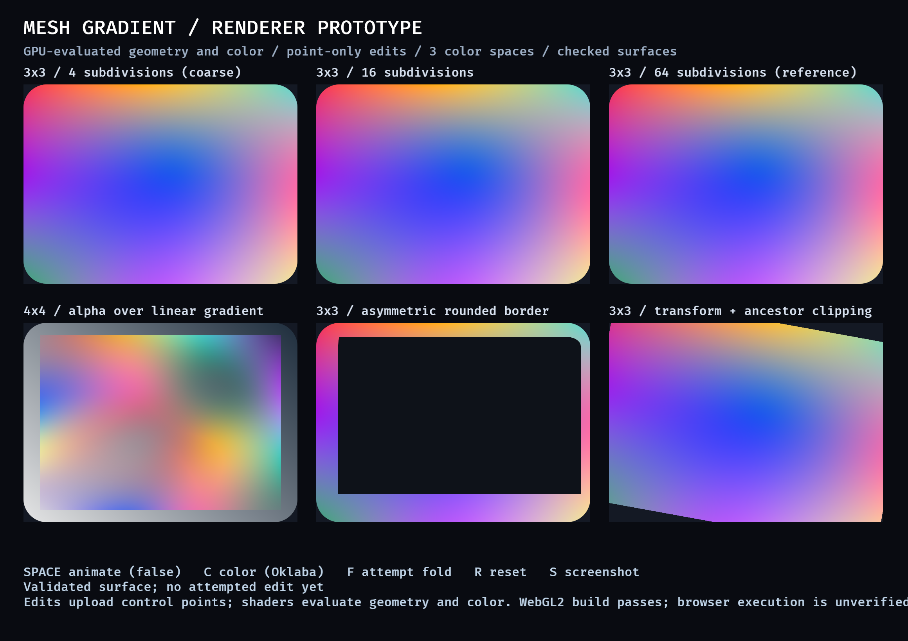

# Mesh-gradient renderer prototype

This throwaway prototype supports the decision in [Choose a mesh-gradient renderer from a visual and performance prototype](https://github.com/AGeorgy/bevy/issues/5). It is intentionally separate from the production API.



## Revised recommendation

Use a checked CPU model with GPU-evaluated interpolation. A gradient edit validates the replacement control grid atomically, then uploads its positions and colors. The vertex shader evaluates the inferred bicubic surface over reusable parameter-space triangles, and the fragment shader evaluates the color cubic directly. Cache and share the parameter topology by grid dimensions and quality tier so it is not regenerated or uploaded for each edit.

This route preserves Bevy UI stacking, clipping, transforms, rounded-background masks, and border masks while using facilities available to the WebGL2 baseline. It avoids a per-fragment inverse solve: interpolation parameters come from the reusable topology, geometry is evaluated in the vertex stage, and color is evaluated in the fragment stage. The initial implementation should select a bounded quality tier internally rather than expose a subdivision count in the public API.

“Point-only edits” means that a mesh-gradient value change uploads the control grid rather than sampled vertices. The renderer still supplies the normal UI node transform and clip state when those independently change, and it creates or reuses a parameter topology when grid dimensions or quality change.

The recommendation remains provisional until the live visual review required by the prototype ticket. Browser execution is also still unverified: the WebGL2 wasm build passes, but the available in-app browser cannot reach a loopback server on this host.

## Prototype architecture

- A checked `MeshSurface` owns a row-major rectangular grid with private points.
- Tensor-product Catmull-Rom interpolation, converted to bicubic Bézier form, infers geometry and color from neighboring points. Boundary ghosts use linear extrapolation.
- An outward-rounded interval certificate proves the symmetric part of the bicubic Jacobian is positive over every patch. This is a conservative sufficient condition for global injectivity of the continuous surface over the normalized logical rectangle.
- `try_replace_points` constructs and validates a complete replacement before swapping it in, so failed edits retain the last valid surface.
- The prototype-only `PrototypeMeshGradient` carries the checked control grid and an internal quality setting through the existing background/border extraction path. It never stores sampled surface vertices.
- The renderer builds parameter-space triangles, packs the control grid and UI state into a shader uniform, evaluates the inferred surface in the vertex shader, and evaluates exact cubic color in the fragment shader before applying existing background, border, and clipping masks.
- The prototype rebuilds parameter topology in the prepare system so the experiment remains local. The production renderer should cache this immutable topology by grid dimensions and quality tier.

The raw transport type is deliberately not the proposed public API. Production reflection and deserialization must enter through checked construction so invalid states cannot be stored.

## Demonstrated cases

The gallery contains the same deformed 3×3 surface at 4, 16, and 64 subdivisions; a translucent inset 4×4 surface over a linear-gradient layer; an asymmetric rounded border; and a transformed node clipped by its ancestor. Keyboard controls switch between OKLab, sRGB, and linear-RGB interpolation, animate interior points, attempt a folded edit, reset, and save a screenshot.

The pure math probe covers valid regular, deformed, inset, and HDR surfaces; malformed dimensions and point counts; non-finite input; invalid alpha; folded and between-node curved-fold rejection; atomic failure; bit-identical shared edges; and resource/numeric limits. A 180-degree rotated logical surface is conservatively rejected; UI transforms remain the supported way to rotate a node.

## Measurements

Measured on an 8-core Apple M1 Pro with 16 GiB RAM. These are single-machine prototype observations, not acceptance budgets.

The optimized pure-CPU validation and reference-tessellation probe measured:

| Grid | Validation | Tessellation at 16 subdivisions per patch | Output |
| --- | ---: | ---: | ---: |
| 3×3 | 8.1 µs | 70.9 µs | 1,156 vertices / 2,048 triangles |
| 5×5 | 32.0 µs | 295.7 µs | 4,624 vertices / 8,192 triangles |
| 9×9 | 123.6 µs | 1,128.7 µs | 18,496 vertices / 32,768 triangles |

The original deliberately uncached CPU gallery regenerated six surfaces, including a 64-subdivision reference, on every animated frame. It spent a median 65.7 ms and p95 69.9 ms in validation and tessellation; total frame time was a median 124.88 ms and p95 126.72 ms.

Across repeated revised GPU-evaluated runs, animated checked point updates took 1.23–1.56 ms median and 1.31–1.63 ms p95. Total frame time ranged from a 10.51 ms median and 12.73 ms p95 when unconstrained to about 16.7 ms under vertical synchronization. These debug-build figures compare prototype architectures rather than establish an acceptance budget; they strongly favor uploading the control grid and evaluating interpolation in shaders.

A pixel comparison of the six static panels against the CPU reference covered 2,142,000 RGB pixels. Mean absolute channel error was `(0.401, 0.270, 0.233)` and maximum channel error was `(13, 9, 11)` on an 8-bit scale. The revised fragment shader evaluates the color cubic directly, while the reference interpolated tessellated vertex colors, so exact pixel identity is not expected.

The native gallery ran through Metal at 2320×1640 physical pixels. The WebGL2 target compiles with Bevy's `ui,webgl2` features and keeps the UI vertex layout at the current 15 attributes, within the 16-attribute downlevel baseline. The prototype uniform remains below the 16 KiB WebGL uniform-buffer baseline. Runtime WebGL2 and WebGPU evidence remains required before production acceptance.

## Run it

```sh
cargo +1.97.1 run --example mesh_gradient_renderer_prototype \
  --no-default-features --features ui
```

Controls: `Space` toggles animation, `C` changes color space, `F` attempts an invalid fold, `R` resets, and `S` writes a screenshot to `/tmp/mesh-gradient-prototype.png`.

Run the non-rendering invariant and timing probe with:

```sh
rustc -O --edition 2024 examples/ui/math_probe.rs -o /tmp/bevy-mesh-math-probe
/tmp/bevy-mesh-math-probe
```

Check the WebGL2 target with:

```sh
cargo +1.97.1 check --target wasm32-unknown-unknown \
  --example mesh_gradient_renderer_prototype \
  --no-default-features --features ui,webgl2
```

## Production constraints exposed by the prototype

- The conservative continuous certificate rejects some globally valid maps; document this behavior and return a precise checked-construction error.
- Final numeric limits must be public behavior. The prototype accepts at most a 4×4 grid, four clip regions, and 64 subdivisions per patch only to exercise the renderer within a compact uniform; those are not proposed public limits.
- The production point transport needs a bounded uniform capacity, storage-buffer path where available, or chunking/data-texture strategy that preserves the WebGL2 baseline for larger supported grids.
- Parameter topology ownership belongs below the public mesh value. Cache it by grid dimensions and quality tier; point edits should update only point data, while transform and clip updates follow their existing UI invalidation paths.
- Screen-space quality selection must keep shared patch edges watertight and account for both geometric and color error. A small set of cached tiers is preferable to rebuilding arbitrary topology each frame.
- Runtime WebGL2 and WebGPU tests must cover shader compilation, clipping, transparent stacking, narrow borders, and limits on actual devices.
- Existing rounded-node masks antialias the node or border outline; the parameter mesh's curved exterior boundary still needs an explicit quality/antialiasing check.
