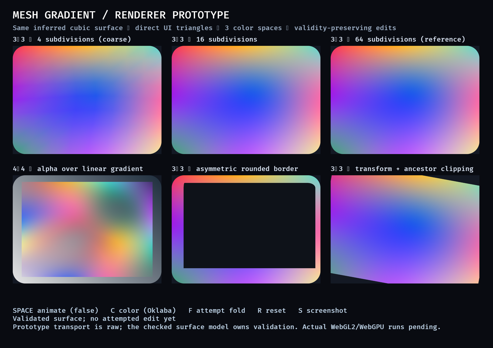

# Mesh-gradient renderer prototype

This throwaway prototype supports the decision in [Choose a mesh-gradient renderer from a visual and performance prototype](https://github.com/AGeorgy/bevy/issues/5). It is intentionally separate from the production API.



## Provisional recommendation

Use CPU tessellation of inferred bicubic patches into the existing Bevy UI gradient pipeline. Cache geometry independently from color data, invalidate only the patches influenced by an edit, and choose subdivision from a bounded screen-space geometry-and-color error rather than exposing a fixed subdivision count in the public API.

This route preserves Bevy UI stacking, clipping, transforms, rounded-background masks, and border masks while using indexed triangles and existing vertex/fragment facilities available to the WebGL2 baseline. It also avoids a per-fragment inverse solve and avoids texture allocation, filtering, and invalidation policy in the first version.

The recommendation remains provisional until the live visual review required by the prototype ticket. Browser execution is also still unverified: the WebGL2 wasm build passes, but the available in-app browser cannot reach a loopback server on this host.

## Prototype architecture

- A checked `MeshSurface` owns a row-major rectangular grid with private points.
- Tensor-product Catmull-Rom interpolation, converted to bicubic Bézier form, infers geometry and color from neighboring points. Boundary ghosts use linear extrapolation.
- An outward-rounded interval certificate proves the symmetric part of the bicubic Jacobian is positive over every patch. This is a conservative sufficient condition for global injectivity of the continuous surface over the normalized logical rectangle.
- `try_replace_points` constructs and validates a complete replacement before swapping it in, so failed edits retain the last valid surface.
- Tessellation rechecks the actual `f32` triangle mesh, shared-edge identity, triangle orientation, finite conversion, index capacity, and a one-million-vertex budget before transport.
- The prototype-only `PrototypeMeshGradient` carries resolved vertices and indices through the existing background/border extraction and batching path. The fragment shader converts the interpolated color coordinates to linear RGB before applying existing UI background or border masks.

The raw transport type is deliberately not the proposed public API. Production reflection and deserialization must enter through checked construction so invalid states cannot be stored.

## Demonstrated cases

The gallery contains the same deformed 3×3 surface at 4, 16, and 64 subdivisions; a translucent inset 4×4 surface over a linear-gradient layer; an asymmetric rounded border; and a transformed node clipped by its ancestor. Keyboard controls switch between OKLab, sRGB, and linear-RGB interpolation, animate interior points, attempt a folded edit, reset, and save a screenshot.

The pure math probe covers valid regular, deformed, inset, and HDR surfaces; malformed dimensions and point counts; non-finite input; invalid alpha; folded and between-node curved-fold rejection; atomic failure; bit-identical shared edges; and resource/numeric limits. A 180-degree rotated logical surface is conservatively rejected; UI transforms remain the supported way to rotate a node.

## Measurements

Measured on an 8-core Apple M1 Pro with 16 GiB RAM. These are single-machine prototype observations, not acceptance budgets.

An optimized pure-CPU probe measured:

| Grid | Validation | Tessellation at 16 subdivisions per patch | Output |
| --- | ---: | ---: | ---: |
| 3×3 | 8.1 µs | 70.9 µs | 1,156 vertices / 2,048 triangles |
| 5×5 | 32.0 µs | 295.7 µs | 4,624 vertices / 8,192 triangles |
| 9×9 | 123.6 µs | 1,128.7 µs | 18,496 vertices / 32,768 triangles |

The deliberately uncached debug gallery, which regenerates six surfaces including a 64-subdivision reference on every animated frame, spent a median 65.7 ms and p95 69.9 ms in validation and tessellation. That result rules out unconditional high-density regeneration. It supports caching, patch-local invalidation, and bounded adaptive quality in the production design.

The native gallery ran through Metal at 2320×1640 physical pixels. The WebGL2 target compiles with Bevy's `ui,webgl2` features and keeps the UI vertex layout at the current 15 attributes, within the 16-attribute downlevel baseline. Runtime WebGL2 and WebGPU evidence remains required before production acceptance.

## Run it

```sh
cargo +1.97.1 run --example mesh_gradient_renderer_prototype \
  --no-default-features --features ui
```

Controls: `Space` toggles animation, `C` changes color space, `F` attempts an invalid fold, `R` resets, and `S` writes a screenshot to `/tmp/mesh-gradient-prototype.png`.

Run the non-rendering invariant and timing probe with:

```sh
rustc -O --edition 2024 examples/ui/math_probe.rs -o /tmp/bevy-mesh-math-probe
/tmp/bevy-mesh-math-probe
```

Check the WebGL2 target with:

```sh
cargo +1.97.1 check --target wasm32-unknown-unknown \
  --example mesh_gradient_renderer_prototype \
  --no-default-features --features ui,webgl2
```

## Production constraints exposed by the prototype

- The conservative continuous certificate rejects some globally valid maps; document this behavior and return a precise checked-construction error.
- Final numeric limits must be public behavior. The prototype's subdivision and vertex caps are evidence for the shape of the policy, not final values.
- Geometry and color cache ownership belongs below the public mesh value. Geometry edits invalidate inferred neighboring patches; color-only edits should avoid rebuilding positions.
- Screen-space refinement must share edge schedules so adjacent patches remain watertight and must consider color error as well as geometric flatness.
- Runtime WebGL2 and WebGPU tests must cover shader compilation, clipping, transparent stacking, narrow borders, and limits on actual devices.
- Existing rounded-node masks antialias the node or border outline; the tessellated mesh's curved exterior boundary still needs an explicit quality/antialiasing check.
